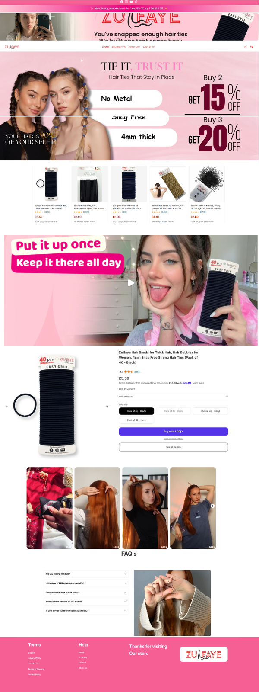
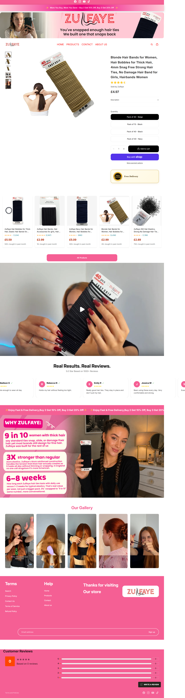
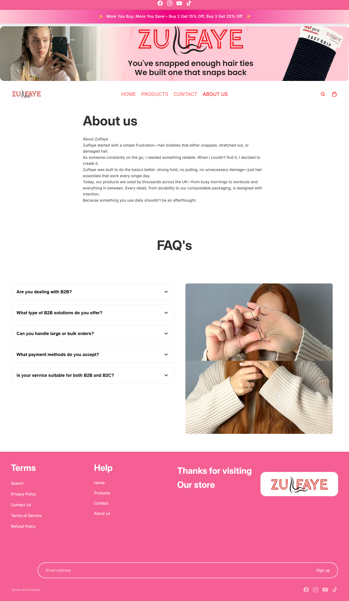

# Shopify Store Development

A professional Shopify store development project showcasing custom store design, theme customization, and eCommerce solutions.

---

## 🚀 About

This repository highlights my Shopify development work, including responsive store design, homepage customization, product page optimization, and custom sections.

I focus on creating high-converting, user-friendly Shopify stores with clean design and optimized performance.

---

## 💼 Services

- Shopify Store Setup
- Shopify Theme Customization
- Custom Shopify Sections
- Product Page Design
- Homepage Design
- Collection Page Customization
- Responsive Design
- Speed Optimization
- Shopify SEO
- Bug Fixes & Store Maintenance

## 📸 Project Preview

### 🏠 Homepage

---

### 📦 Product Page

---

### 👨‍💼 About Us Page

---

## 🛠️ Technologies Used

- Shopify
- Liquid
- HTML5
- CSS3
- JavaScript
- JSON
- Git
- GitHub

---

## ✨ Features

- Fully Responsive Design
- Modern UI/UX
- Mobile Friendly
- Optimized Store Performance
- Clean & Organized Code
- Custom Shopify Sections
- SEO Friendly Structure

---

## 🎯 Project Goal

The goal of this project is to demonstrate professional Shopify development skills, including theme customization, responsive layouts, and custom store functionality.

---

## 👨‍💻 Author

**Muhammad Arslan**

**Shopify Store Developer | Shopify Designer | Meta Ads Specialist**

---

## 📬 Contact

📧 Email: arslannadeem0335@gmail.com

💼 LinkedIn:
[https://www.linkedin.com/in/your-profile](https://www.linkedin.com/in/muhammad-arslan-nadeem-531168392/)

---

⭐ If you like this project, don't forget to give it a Star.
